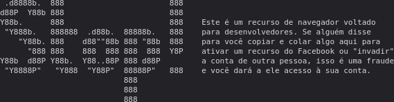

# Tela de login nova facebook
## tentei criar a tela de login nova do facebook

### HTML/PHP:
```
    <!DOCTYPE html>
<html lang="pt-BR">
<head>
    <meta charset="UTF-8">
    <meta name="viewport" content="width=device-width, initial-scale=1.0">
    <title>Login facebook</title>
    <link rel="stylesheet" href="css/style.css">
<link rel="stylesheet" href="https://cdn.jsdelivr.net/npm/bootstrap-icons@1.10.5/font/bootstrap-icons.css">
</head>
<body>

    <section class="main">
        <div class="all">
            <div class="align">
        <div class="sl">
            <h1>facebook</h1>
            <h2>O Facebook ajuda você a se conectar e compartilhar com as pessoas que fazem parte da sua vida.</h2>
            </div>
            <div>
                <div class="">
            <form action="" class="form">
                <div>
                <input type="email" name="email" id="email" placeholder="Email ou telefone">
                </div>
                <div>
                <input type="password" name="pass" id="pass" placeholder="Senha">
                </div>
                <input type="submit" value="Entrar">
                <a href="#"><p>Esqueceu seu senha?</p></a>
                <input type="submit" value="Criar nova conta">
            </form>
            <h4><span>Criar uma Página</span> para uma celebridade, uma marca ou uma <br> empresa.</h4>
            </div>
            </div>
        </div>  
    </section>


    <section class="linguas">
        <div class="center1">
            <?php $ling = array("Português","Inglês","Espanhol","Francês","Alemão","Italiano","Japonês","Chinês","Russo","Árabe","Hindi","Coreano","Holandês","Sueco","Turco"
); 
            foreach($ling as $lingv){
?>
            <a href="#" class="sl-lin"><?php echo $lingv ?></a>
            <?php } ?>
            <i class="bi bi-plus edd"></i>
        </div><!--center-->
        <div class="center">
            <?php $palavrasFacebook = array(
    "rede social", "amigos", "compartilhar", "curtir", "publicações",
    "perfil", "notificações", "mensagens", "fotos", "vídeos",
    "postagens", "feed", "amizade", "seguidores", "página",
    "grupos", "evento", "marcar", "timeline", "comentários",
    "emojis", "reagir", "privacidade", "configurações", "perfil público",
    "bloquear"
);
            foreach($palavrasFacebook as $txt){ ?>
            <a href="#" type="teste"><?php print $txt ?></a>
        <?php } ?> 
        </div><!--center-->
    </section><!--linguas-->
    <script src="js/script.js"></script>
</body>
</html>
```

### CSS:

```
    *{
    padding: 0;
    margin: 0;
    box-sizing: border-box;
    font-family: 'Helvetica Neue', sans-serif;
}
body,html{
    height: 100%;
}
a{
    text-decoration: none;
}
/*=================CLEAR=====================*/
.clear{clear: both;}
/*=================FONTS=====================*/
    /*
    font-family: 'Fira Sans', sans-serif;
    font-family: 'Open Sans', sans-serif;
    */
/*=================HEADER====================*/
.center1{
    max-width: 1100px;
    padding: 0 2%;
    margin: 0 auto;
}
section.main{
    height: 100%;
    background-image: linear-gradient(#FFFFFF, #D3D8E8);
    padding: 40px 0;
}
section.linguas{
    padding: 30px 0;
}
section.linguas a{
    color: #365899;
    font-size: 12px;
    padding-right: 15px;
}
section.linguas a.sl-lin{
    color: #737373;
}
section.linguas .center1{
    padding-left: 8px;
    padding-right: 8px;
    padding-bottom: 10px;
    border-bottom: 1px solid #CCCCCC;
}
.center{
    max-width: 1100px;
    padding: 0 2%;
    margin-top: 5px;
    margin-left: 112px;
}


.main > .all h1{
    color: #1877f2;
    font-weight: bold;
    font-size: 55px;
}
.main > .all h2{
    width: 100%;
    max-width: 500px;
    font-size: 25px;
    font-weight: normal;
}
.form{
    max-width: 396px;
    text-align: center;
    background-color: #FFFFFF;
    padding: 10px;
    border-radius: 8px;
    box-shadow: 1px 1px 9px 0.8px #00000011;
}
.all > h4{
    max-width: 396px;
    text-align: center;
}
.form input[type="email"],
.form input[type="password"]{
    width: 364px;
    height: 52px;
    border-radius: 8px;
    margin: 5px;
    margin-top: 15px;
    color: #c2c4c9;
    border: 1px solid #c2c4c9;
    padding: 15px;
    outline: none;
}
.form input:focus{
    border: 2px solid #1877f2;
}
.form input[type="submit"]{
    cursor: pointer;
}
.form input[value="Entrar"]{
    width: 364px;
    height: 52px;
    font-size: 22px;
    font-weight: 550;
    margin-top: 10px;
    color: #FFFFFF;
    background-color: #1877f2;
    border: none;
    border-radius: 8px;
}
.form p{
    font-size: 14px;
    margin: 30px;
}
.form p:hover{
    text-decoration: underline;
}
.form input[value="Criar nova conta"]{
    width: 50%;
    height: 50px;
    margin-bottom: 30px;
    border: none;
    border-radius: 8px;
    font-size: 16px;
    font-weight: bold;
    color: #FFFFFF;
    background-color: #42b72a;
    transition: 0.2s;
}
.form input[value="Criar nova conta"]:hover{
    background-color: #3aa727;
}

.all h4{
    font-size: 12px;
    font-weight: normal;
    margin-top: 33px;
    max-width: 396px;
    text-align: center;
}
.all span{
    font-weight: bold;
}
.all span:hover{
    text-decoration: underline;
}
.align{
    margin: 0 auto;
    margin-top: 80px;
    margin-right: 70px;
    display: flex;
    justify-content: center;
    align-items: center;
}
.sl{
    margin: 70px;
    position: relative;
    top: -50px;
}
@media screen and (max-width: 500px){
    section.main{
        text-align: center;
        width: 100%;
        height: auto;
    background-image: linear-gradient(#FFFFFF, #D3D8E8);
    }
    a{
        text-decoration: underline;
    }
    span{
        text-decoration: underline;
    }
    .align{
        width: 100%;
        flex-direction: column;
    }
    .sl{
        margin: 10px;
        position: relative;
        top: -50px;
    }
}
```

## JS -> DO CONSOLE MSG:


### JS:
```
    console.log(`


                                            
.d8888b.  888                       888    
d88P  Y88b 888                       888    
Y88b.      888                       888    Este é um recurso de navegador voltado 
"Y888b.   888888  .d88b.  88888b.   888    para desenvolvedores. Se alguém disse 
   "Y88b. 888    d88""88b 888 "88b  888    para você copiar e colar algo aqui para 
     "888 888    888  888 888  888  Y8P    ativar um recurso do Facebook ou "invadir" 
Y88b  d88P Y88b.  Y88..88P 888 d88P         a conta de outra pessoa, isso é uma fraude 
"Y8888P"   "Y888  "Y88P"  88888P"   888    e você dará a ele acesso à sua conta.
                          888              
                          888              
                          888              

Consulte https://www.facebook.com/selfxss para obter mais informações.

By DevSozinho

`)
```

##### NOTA:
```
    Site feito com objetivo de estudo.
```